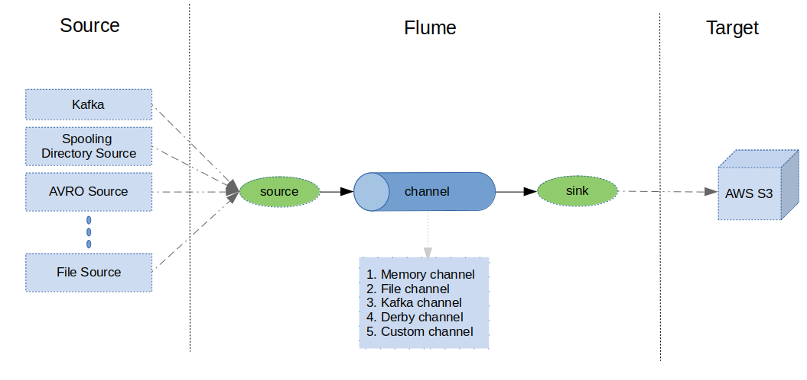

# CUSTOM FLUME SINK FOR AWS S3

## INTRODUCTION
This is a custom flume sink for writing data to AWS s3. it uses AWS profile credentials (Credentials stored in 
~/.aws/credentails file), so it enables to have any type of credentials like 
1. IAM USER (Static Credentials : access_key, secret_key)
2. ASSUMED ROLE (Temporary Credentials : access_key, secret_key and session_token)
3. FEDERATED TOKEN   

it support various features like
1. Batch Size
2. Roll Interval
3. Compression
4. File Prefix
5. File Sufix

It auto partitions the data while writing into S3 based on date and hours. 
For example, the file path will look like this 
```
s3://customers/partition-date=28-05-2019/partition-hours=22-00/....
```

##### BASIC ARCHITECTURE



##### DEFAULT VALUES FOR THE SINK PARAMETERS
```
   defaultRollInterval           = 300;
   defaultBatchSize              = 500;
   defaultAvroSchema             = "";
   defaultAvroSchemaRegistryURL  = "";
   defaultFilePrefix             = "flumeS3Sink";
   defaultFileSufix              = ".data";
   defaultTempFile               = "/tmp/flumes3sink/data/file";
   defaultCompress               = "false";
```
## HOW TO BUILD 
There are many ways to build the jar from the source. one simplest way is using the below cmd

1. Clone the git repo
2. Run the maven cmd
```
mvn package 
```

###### Reference : <i>https://maven.apache.org/guides/getting-started/maven-in-five-minutes.html </i>

## HOW TO CONFIGURE THE JAR
1. Goto the flume installation directory and find the .../conf/flume-env.sh
2. Add the fully qualified jar path to the FLUME_CLASSPATH in flume-env.sh
```
FLUME_CLASSPATH="/home/ravindrachellubani/Documents/code/git/flumes3sink/target/flume-s3-sink-1.0-SNAPSHOT-jar-with-dependencies.jar"
export FLUME_CLASSPATH=$FLUME_CLASSPATH:/home/ravindrachellubani/Documents/code/git/printsink/target/print-sink-1.0-SNAPSHOT-jar-with-dependencies.jar
```
## HOW TO RUN 
Here is the sample flume agent configuration snippet for the sink

```
# FLUME SINK CONF
#-----------------
# don't give / at the end for the bucketname
# roll interval is in seconds
# compression codec is snappy

a1.sinks.k1.type = com.rab4u.flume.FlumeS3Sink
a1.sinks.k1.s3.bucketName = dp-cts-stream-test/after-sales/tracking
a1.sinks.k1.s3.awsRegion = eu-central-1
a1.sinks.k1.s3.filePrefix = after-sales
a1.sinks.k1.s3.FileSufix = avro
a1.sinks.k1.s3.rollInterval = 60
a1.sinks.k1.s3.tempFile = /home/ravindrachellubani/Documents/code/git/apache-flume-to-s3/after-sales-temp-file
a1.sinks.k1.s3.AvroSchema = /home/ravindrachellubani/Documents/code/git/apache-flume-to-s3/tracking.avsc
a1.sinks.k1.s3.batchSize = 500
a1.sinks.k1.s3.compress = false
# a1.sinks.k1.s3.AvroSchemaRegistryURL = "<SCHEMA REGISTRY URL>"
```
## TROUBLESHOOTING
1. HEAP MEMORY ISSUE

Solution :

open the flume-env.sh and change the below configuration
```
JAVA_OPTS="-Xms500m -Xmx1000m -Dcom.sun.management.jmxremote"
export JAVA_OPTS="$JAVA_OPTS ...................."
```
2. AWS Credentials Not Found

check the ~/.aws/credentials file is present or not. if not create by running the following cmd
```
aws configure
```
## REFERENCES
1. https://flume.apache.org/FlumeDeveloperGuide.html
2. https://github.com/apache/flume
3. https://docs.aws.amazon.com/AmazonS3/latest/dev/UploadObjSingleOpJava.html